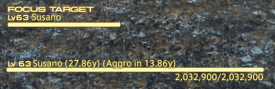

# Distance

## Purpose
**WARNING: PRE-ALPHA PLUGIN**

This is a plugin for [XIVLauncher/Dalamud](https://github.com/goatcorp/FFXIVQuickLauncher) that shows basic distance information in a movable game UI element.

## Usage
This plugin works automatically, showing the distance to the target.  In the future, it will show distance until aggroing the boss (for supported bosses).

## License
Code and executable are covered under the [MIT License](../LICENSE).  Final Fantasy XIV (and any associated data used by this plugin) is owned by and copyright Square Enix.

Text node creation code stolen from [SimpleTweaks](https://github.com/Caraxi/SimpleTweaksPlugin).